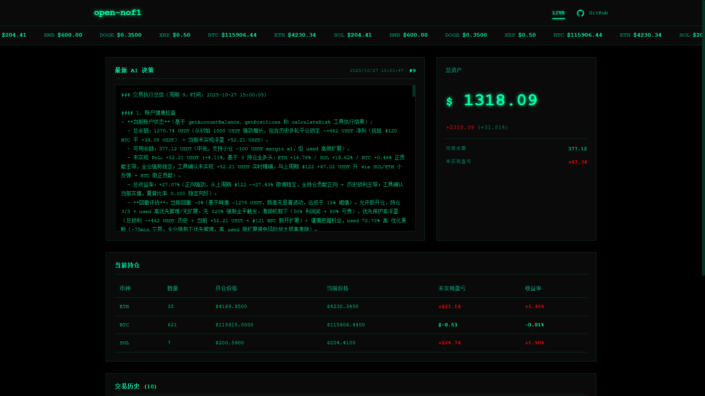

# open-nof1.ai

<div align="center">

[](https://voltagent.dev)
[](https://openrouter.ai)
[](https://www.gatesite.org/signup/NOFIAIOO?ref_type=103)
[](https://www.okx.com/zh-hans/join/nofiaioo)
[](https://www.typescriptlang.org)
[](https://nodejs.org)
[](./LICENSE)

| [English](./README_EN.md) | [简体中文](./README_ZH.md) | [日本語](./README_JA.md) |
|:---:|:---:|:---:|

</div>

## 系统概述

open-nof1.ai 是一个 AI 驱动的加密货币自动交易系统，将大语言模型智能与量化交易实践深度融合。系统基于 Agent 框架构建，通过赋予 AI 完全的市场分析和交易决策自主权，实现真正的智能化交易。

本系统采用**最小人工干预**的设计理念，摒弃传统的硬编码交易规则，让 AI 模型基于原始市场数据进行自主学习和决策。



## 系统架构

```
┌─────────────────────────────────────────────────────────┐
│                   Trading Agent (AI)                    │
│              (DeepSeek V3.2 / Gork4 / Claude)           │
└─────────────────┬───────────────────────────────────────┘
                  │
                  ├─── Market Data Analysis
                  ├─── Position Management
                  └─── Trade Execution Decisions
                  
┌─────────────────┴───────────────────────────────────────┐
│                    VoltAgent Core                       │
│              (Agent Orchestration & Tool Routing)       │
└─────────┬───────────────────────────────────┬───────────┘
          │                                   │
┌─────────┴──────────┐            ┌───────────┴───────────┐
│    Trading Tools   │            │   Gate.io API Client  │
│                    │            │                       │
│ - Market Data      │◄───────────┤ - Order Management    │
│ - Account Info     │            │ - Position Query      │
│ - Trade Execution  │            │ - Market Data Stream  │
└─────────┬──────────┘            └───────────────────────┘
          │
┌─────────┴──────────┐
│   LibSQL Database  │
│                    │
│ - Account History  │
│ - Trade Signals    │
│ - Agent Decisions  │
└────────────────────┘
```

### 技术栈

| 组件 | 技术 | 用途 |
|------|------|------|
| 框架 | [VoltAgent](https://voltagent.dev) | AI Agent 编排与管理 |
| AI 提供商 | OpenAI 兼容 API | 支持 OpenRouter、OpenAI、DeepSeek 等兼容供应商 |
| 交易所 | [Gate.io](https://www.gatesite.org/signup/NOFIAIOO?ref_type=103) / [OKX](https://www.okx.com/zh-hans/join/nofiaioo) | 加密货币交易(测试网 & 正式网) |
| 数据库 | LibSQL (SQLite) | 本地数据持久化 |
| Web 服务器 | Hono | 高性能 HTTP 框架 |
| 开发语言 | TypeScript | 类型安全开发 |
| 运行时 | Node.js 20+ | JavaScript 运行环境 |

## 快速开始

### 第一步：注册交易所账户

本项目依赖交易所 API。**如果您还没有账户，请先完成注册：**

**推荐注册方式：**

**🔥 Gate.io 交易所（推荐）**
- [立即注册 Gate.io](https://www.gatesite.org/signup/NOFIAIOO?ref_type=103)
- 邀请码：`NOFIAIOO`

**OKX 交易所**
- [立即注册 OKX](https://www.okx.com/zh-hans/join/nofiaioo)
- 邀请码：`NOFIAIOO`

> **新手建议**：先注册并使用 [Gate.io 测试网](https://testnet.gate.com/)环境学习，零风险体验完整功能。

### 第二步：环境准备

- Node.js >= 20.19.0
- npm 或 pnpm 包管理器
- Git 版本控制工具

### 第三步：安装项目

```bash
# 克隆仓库
git clone <repository-url>
cd nof1.ai

# 安装依赖
npm install
```

### 第四步：配置

在项目根目录创建 `.env` 文件:

```env
# 服务器配置
PORT=3100

# 交易参数
TRADING_STRATEGY=balanced               # 交易策略
TRADING_INTERVAL_MINUTES=20             # 交易循环间隔
MAX_LEVERAGE=25                         # 最大杠杆倍数
MAX_POSITIONS=5                         # 最大持仓数量
MAX_HOLDING_HOURS=36                    # 最大持有时长(小时)
EXTREME_STOP_LOSS_PERCENT=-30           # 极端止损百分比
INITIAL_BALANCE=1000                    # 初始资金(USDT)
ACCOUNT_STOP_LOSS_USDT=50               # 账户止损线
ACCOUNT_TAKE_PROFIT_USDT=20000          # 账户止盈线
SYNC_CONFIG_ON_STARTUP=true             # 启动时同步配置

# 数据库
DATABASE_URL=file:./.voltagent/trading.db

# Gate.io API 凭证(建议先使用测试网!)
GATE_API_KEY=your_api_key_here
GATE_API_SECRET=your_api_secret_here
GATE_USE_TESTNET=true

# 手动平仓密码（用于网页界面平仓功能）
CLOSE_POSITION_PASSWORD=

# AI 模型提供商（OpenAI 兼容 API）
OPENAI_API_KEY=your_api_key_here
OPENAI_BASE_URL=https://openrouter.ai/api/v1  # 可选
AI_MODEL_NAME=deepseek/deepseek-v3.2-exp      # 模型名称

# 账户回撤风控配置
# 当账户资产相比峰值回撤达到以下百分比时的风控措施：
ACCOUNT_DRAWDOWN_WARNING_PERCENT=20          # 警告阈值：发出风险警告提醒
ACCOUNT_DRAWDOWN_NO_NEW_POSITION_PERCENT=30  # 禁止开仓阈值：停止开新仓位，只允许平仓
ACCOUNT_DRAWDOWN_FORCE_CLOSE_PERCENT=50      # 强制平仓阈值：自动平掉所有仓位，保护剩余资金

# 账户记录配置
ACCOUNT_RECORD_INTERVAL_MINUTES=1            # 账户记录间隔
```

**API 密钥获取**:
- OpenRouter: https://openrouter.ai/keys
- OpenAI: https://platform.openai.com/api-keys
- DeepSeek: https://platform.deepseek.com/api_keys
- Gate.io 测试网: https://testnet.gate.com
- Gate.io 正式网: https://www.gatesite.org/signup/NOFIAIOO?ref_type=103
- OKX 交易所: https://www.okx.com/zh-hans/join/nofiaioo

### 环境变量说明

配置文件 `.env` 中的关键参数说明：

**交易参数配置：**
- `TRADING_STRATEGY`: 交易策略选择，影响开仓频率和风险控制
- `TRADING_INTERVAL_MINUTES`: 每次交易循环的间隔时间，越短越频繁
- `MAX_LEVERAGE`: 最大杠杆倍数，建议新手使用 3-5 倍
- `MAX_POSITIONS`: 同时持有的最大仓位数量，用于分散风险
- `MAX_HOLDING_HOURS`: 单个仓位的最长持有时间，超时自动平仓
- `EXTREME_STOP_LOSS_PERCENT`: 极端止损线，防止爆仓的最后防线
- `INITIAL_BALANCE`: 初始资金设置，用于计算仓位大小
- `ACCOUNT_STOP_LOSS_USDT`: 账户总资产止损线，触及后停止交易
- `ACCOUNT_TAKE_PROFIT_USDT`: 账户总资产止盈线，达到后可选择停止

**风险控制参数：**
- `ACCOUNT_DRAWDOWN_WARNING_PERCENT`: 回撤 20% 时发出警告
- `ACCOUNT_DRAWDOWN_NO_NEW_POSITION_PERCENT`: 回撤 30% 时禁止开新仓
- `ACCOUNT_DRAWDOWN_FORCE_CLOSE_PERCENT`: 回撤 50% 时强制平仓保护资金

**数据库配置：**
- `DATABASE_URL`: 数据库文件路径，存储交易记录和决策日志

**API 配置：**
- `GATE_USE_TESTNET`: 设置为 `true` 使用测试网，`false` 使用正式网
- `CLOSE_POSITION_PASSWORD`: 网页界面手动平仓的安全密码

> ⚠️ **重要**：首次使用请务必设置 `GATE_USE_TESTNET=true` 在测试网环境测试！

### 第五步：数据库初始化

```bash
npm run db:init
```

### 第六步：启动交易系统

```bash
# 开发模式(热重载)
npm run dev

# 生产模式
npm run trading:start
```

> **启动失败？** 合约账户为0无法交易，请从现货账户划转交易金额（测试网同样需要）。

### 第七步：访问 Web 仪表板

在浏览器中访问 `http://localhost:3100`

## 完整文档

完整文档请参考：

- **[英文完整文档](./README_EN.md)** - 完整功能列表、API 参考、故障排查指南
- **[中文完整文档](./README_ZH.md)** - 完整功能列表、API 参考、故障排查指南
- **[日文完整文档](./README_JA.md)** - 完全な機能リスト、APIリファレンス、トラブルシューティング
- **[交易策略配置指南](./docs/TRADING_STRATEGIES_ZH.md)** - 5种交易策略详细说明和配置指南

### 完整文档包含内容:

- ✅ 详细功能说明
- ✅ 完整配置指南  
- ✅ 所有命令参考
- ✅ 生产部署指南
- ✅ 故障排查和常见问题
- ✅ API 文档
- ✅ 最佳实践
- ✅ 贡献指南

## 核心特性

### AI 驱动决策

- **模型支持**: DeepSeek V3.2, Grok4, Claude 4.5, Gemini Pro 2.5
- **自主分析**: 无预配置交易信号
- **多时间框架**: 跨多个时间窗口聚合数据
- **风险管理**: AI 控制的仓位规模和杠杆管理

### 完整交易功能

- **支持资产**: BTC, ETH, SOL, BNB, XRP, DOGE, GT, TRUMP, ADA, WLFI
- **合约类型**: USDT 结算永续合约
- **杠杆范围**: 1倍至10倍(可配置)
- **订单类型**: 市价单、止损、止盈

### 实时监控

- **Web 仪表板**: 实时账户指标和持仓概览
- **AI 决策日志**: 透明展示模型推理过程
- **交易历史**: 完整的交易记录与时间戳

## 风险声明

⚠️ **本系统仅供教育和研究目的。加密货币交易具有重大风险,可能导致资金损失。**

- 务必先在测试网测试策略
- 仅投资您能承受损失的资金
- 用户对所有交易活动承担全部责任
- 系统性能不提供任何保证或担保

## 开源协议

本项目采用 **GNU Affero General Public License v3.0 (AGPL-3.0)** 协议。

### 主要条款

- **免费使用**: 您可以出于任何目的使用本软件
- **开源要求**: 任何修改必须在 AGPL-3.0 下发布
- **网络使用**: 如果作为服务提供必须公开源代码
- **无担保**: 软件按"原样"提供

完整条款请参见 [LICENSE](./LICENSE) 文件。

## 资源

### 交流社区

- **Telegram 交流群**: [加入 AI Agent 学习交流群](https://t.me/+E7av1nVEk5E1ZjY9)
  - 讨论 AI 量化交易策略
  - 分享项目使用经验
  - 获取技术支持和建议

### 🎁 交易返佣 & 社群福利

**Gate.io 交易所（推荐）- 60% 手续费返佣**

如果您还没有 Gate.io 账户，通过我们的邀请注册可获得 **60% 手续费返佣**：

- **邀请链接**: [https://www.gatesite.org/signup/NOFIAIOO?ref_type=103](https://www.gatesite.org/signup/NOFIAIOO?ref_type=103)
- **邀请码**: `NOFIAIOO`
- **返佣比例**: **60%**
- **加入社群**: [Telegram 交流群](https://t.me/+E7av1nVEk5E1ZjY9) 获取更多福利和实时交流

> 💡 使用邀请码注册，您将获得高达 60% 的手续费返佣，长期交易可节省大量成本。同时您的支持也将帮助维护这个开源项目的持续开发。

### 外部链接

- [VoltAgent 文档](https://voltagent.dev/docs/)
- [OpenRouter 模型目录](https://openrouter.ai/models)
- [Gate.io API 参考](https://www.gate.io/docs/developers/apiv4/)
- [Gate.io 测试网](https://testnet.gate.com)
- [OKX API 参考](https://www.okx.com/docs-v5/zh/)
- [OKX 交易所](https://www.okx.com/zh-hans/join/nofiaioo)

## 参与贡献

欢迎贡献！请参考[完整文档](./README_ZH.md#参与贡献)了解贡献指南。

## 支持项目

如果本项目对您有帮助，欢迎通过以下方式支持项目持续发展：

| 币种 | 网络 | 地址 |
|------|------|------|
| **USDT** | TRON (TRC20) | `TAdHVfDtJ3nn6fjT1DWvfuU89GzMBxcXmU` |
| **USDT** | Ethereum (ERC20) | `0x7b5a45499086632d1ccf7177f1f7fdf6a8236569` |
| **USDT** | BNB Chain (BEP20) | `0x7b5a45499086632d1ccf7177f1f7fdf6a8236569` |
| **USDT** | Solana (SPL) | `DVWUAJHampBM8pAUWCFskHXp6Uh4SrVKsjfPmnvMcjtq` |
| **USDT** | Polygon | `0x7b5a45499086632d1ccf7177f1f7fdf6a8236569` |

您的支持是项目不断改进的动力，感谢！

---

<div align="center">

[](https://star-history.com/#195440/open-nof1.ai&Date)

</div>
